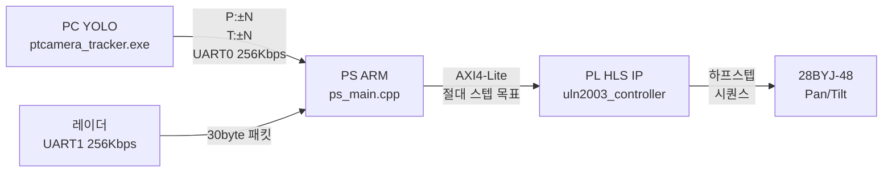
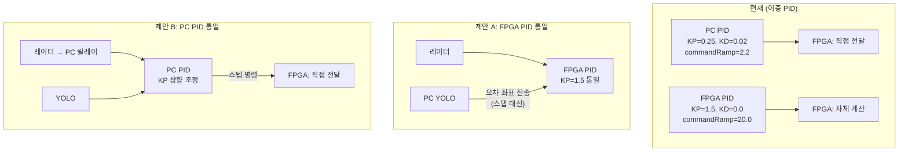

# 모터 제어 코드 분석 및 수정 방향 제안

> **분석 대상 파일:**
> - [ps_main.cpp](file:///c:/Users/kimse/capstone/antidrone/vitis_workspace/antidrone_app/src/ps_main.cpp) — FPGA PS 메인 (Zynq ARM, 베어메탈)
> - [control.cpp](file:///c:/Users/kimse/capstone/antidrone/cpp/src/control.cpp) — PC측 PID 컨트롤러
> - [settings.hpp](file:///c:/Users/kimse/capstone/antidrone/cpp/include/ptcamera/settings.hpp) — PC측 설정 기본값
> - [ptcamera_tracker.cpp](file:///c:/Users/kimse/capstone/antidrone/cpp/apps/ptcamera_tracker.cpp) — PC측 메인 루프
> - [serial_port.cpp](file:///c:/Users/kimse/capstone/antidrone/cpp/src/serial_port.cpp) — UART 통신
> - [uln2003_controller.cpp](file:///c:/Users/kimse/capstone/Vitis/uln2003_controller.cpp) — HLS IP (PL)

---

## 1. 현재 시스템 구조 요약



**두 가지 제어 경로:**
- **AI 추적 모드**: PC YOLO → P:/T: 직접 스텝 → `motor_update_full_host()`
- **레이더 단독 모드**: 레이더 방위각 → PID → `motor_update_hybrid()` (Pan: PID, Tilt: PC T: 스텝)

---

## 2. 발견된 문제점

### 🔴 심각 (동작 정확성에 직접 영향)

#### 2-1. PC–FPGA 간 PID 파라미터 불일치 (이중 PID 충돌)

> [!CAUTION]
> PC와 FPGA 양쪽에 **독립적인 PID 컨트롤러**가 존재하며, 파라미터가 완전히 다릅니다.

| 파라미터 | PC ([settings.hpp:44-51](file:///c:/Users/kimse/capstone/antidrone/cpp/include/ptcamera/settings.hpp#L44-L51)) | FPGA ([ps_main.cpp:74-96](file:///c:/Users/kimse/capstone/antidrone/vitis_workspace/antidrone_app/src/ps_main.cpp#L74-L96)) |
|---|---|---|
| KP | 0.25 | **1.5** |
| KD | 0.02 | **0.0** |
| KI | 0.0 | *(없음)* |
| commandRamp | 2.2 | **20.0** |
| acquireRampScale | 0.6 | **1.0** |
| panMaxStep | 48 | **58** |
| panMinStep | 8 | **5** |

**문제점:**
- AI 추적 모드에서 PC의 PID가 스텝을 계산(`control.cpp`)하고 → FPGA에 전달하면 → FPGA는 별도 PID 없이 직접 스텝만 실행(`motor_update_full_host`)
- 그런데 **레이더 단독 모드**에서는 FPGA 자체 PID를 사용(`motor_update_hybrid` → `motor_pid_step`)
- 결과: **두 모드 간 모터 응답 특성이 완전히 다름** (PC PID: KP=0.25로 느리고, FPGA PID: KP=1.5로 빠름)

#### 2-2. Kalman HLS DT 불일치 → 속도 추정 3배 오차

([OPEN_ISSUES.md:A2](file:///c:/Users/kimse/capstone/docs/OPEN_ISSUES.md#L18-L22)에서 이미 인지됨)

- Kalman IP 내부 `DT = 0.1f` (10Hz 가정), 실제 루프 `33ms` (30Hz)
- `vx`, `vy` 속도 추정치가 **3배 과대 산출** → 예측 추적 시 오버슈트 발생 가능

#### 2-3. `g_host_pan/tilt_steps` 매 프레임 0 리셋 문제

[ps_main.cpp:802-803](file:///c:/Users/kimse/capstone/antidrone/vitis_workspace/antidrone_app/src/ps_main.cpp#L802-L803):
```cpp
g_host_pan_steps  = 0;
g_host_tilt_steps = 0;
```

- PC가 30Hz로 전송해야 모터가 계속 움직이지만, **UART 전송 지연/패킷 유실** 발생 시 모터가 멈춤
- `AI_LOCK_FRAMES=4` (132ms)로 일부 보호하지만, PC 측 `sendInterval=66ms`와 어긋날 수 있음

---

### 🟡 중간 (성능/안정성)

#### 2-4. LP 필터 α=0.4 고정 — 상황 적응 불가

[ps_main.cpp:759](file:///c:/Users/kimse/capstone/antidrone/vitis_workspace/antidrone_app/src/ps_main.cpp#L759):
```cpp
rang_lp = 0.4f * (float)rang + 0.6f * rang_lp;
```

- 빠르게 움직이는 드론에는 지연이 크고, 느리게 움직이는 드론에는 노이즈 억제 부족
- 레이더 속도(speed)에 따라 α를 동적 조절하면 성능 향상 가능

#### 2-5. HLS IP `hw_delay()` — 타이밍 불확실성

[uln2003_controller.cpp:4-10](file:///c:/Users/kimse/capstone/Vitis/uln2003_controller.cpp#L4-L10):
```cpp
void hw_delay(int delay_count) {
    volatile int dummy = 0;
    for (int i = 0; i < delay_count; i++) {
        dummy++;
    }
}
```

- **busy-wait 루프**로 딜레이를 구현 → HLS 합성 후 실제 지연 시간이 클럭/최적화에 따라 변동
- 실측으로 교정했다고 하나(`200 → 0.57ms`), **합성 설정 변경 시 재교정** 필요

#### 2-6. AP_IDLE 체크 시 프레임 드롭 가능성

[ps_main.cpp:659](file:///c:/Users/kimse/capstone/antidrone/vitis_workspace/antidrone_app/src/ps_main.cpp#L659):
```cpp
if (!(MOTOR_RD(0x00) & AP_IDLE)) return;
```

- IP가 아직 실행 중이면 **해당 프레임의 모터 명령 전체를 버림**
- 연속 프레임에서 IP가 바쁘면 여러 프레임 명령이 소실될 수 있음

#### 2-7. 모터 절대 위치 `g_motor_abs_pan/tilt` 리셋 메커니즘 부재

- 전원 사이클 없이는 `g_motor_abs_pan/tilt`가 무한히 증가/감소
- HLS IP의 `static current_pan/tilt`와 동기화 보장 수단 없음
- 원점 복귀(homing) 기능 없음

---

### 🟢 낮음 (코드 품질/유지보수)

#### 2-8. 코드 중복 — `motor_update_hybrid` vs `motor_update_full_host`

[ps_main.cpp:634-704](file:///c:/Users/kimse/capstone/antidrone/vitis_workspace/antidrone_app/src/ps_main.cpp#L634-L704):
- 두 함수가 **IP 쓰기/시작 로직을 95% 공유**하면서 분리되어 있음
- 수정 시 양쪽을 동시에 바꿔야 하는 위험

#### 2-9. 매직 넘버 하드코딩

- 레지스터 오프셋 (`0x10`, `0x18`, `0x20`, `0x00`)이 매크로 없이 직접 사용
- HLS IP 레지스터 맵 변경 시 여러 곳 수정 필요

#### 2-10. PC 측 `control.cpp` PID에 I항(적분)이 있지만 사용 안 함

[settings.hpp:45-49](file:///c:/Users/kimse/capstone/antidrone/cpp/include/ptcamera/settings.hpp#L45-L49):
```cpp
double panKi = 0.0;  // 적분 게인 = 0
double panKd = 0.02;
```

- 코드에 I항 로직이 구현되어 있지만 `Ki=0.0`으로 비활성
- FPGA PID에는 아예 I항 로직 자체가 없음
- 설계 의도가 불명확 → 데드 코드이거나 미래용

---

## 3. 수정 방향 제안

### 🔥 우선순위 1: PID 파라미터 통일 및 제어 아키텍처 정비



> [!IMPORTANT]
> **제안 A (FPGA PID 통일)** 추천:
> - PC는 bbox 중심 오차 좌표만 전송 (`E:errX,errY\n`)
> - FPGA가 레이더/카메라 소스 무관하게 **하나의 PID**로 처리
> - 통신 지연에 의한 모터 응답 지연 최소화 (FPGA에서 실시간 PID)
> - 파라미터 튜닝 포인트가 하나로 수렴

#### 구현 시 변경 범위:
| 파일 | 변경 내용 |
|---|---|
| [ps_main.cpp](file:///c:/Users/kimse/capstone/antidrone/vitis_workspace/antidrone_app/src/ps_main.cpp) | `host_parse_commands()`에 `E:errX,errY` 파서 추가, Pan/Tilt 모두 `motor_pid_step()` 경유 |
| [serial_port.cpp](file:///c:/Users/kimse/capstone/antidrone/cpp/src/serial_port.cpp) | `sendErrorCommand(errX, errY)` 추가 |
| [ptcamera_tracker.cpp](file:///c:/Users/kimse/capstone/antidrone/cpp/apps/ptcamera_tracker.cpp) | `sendPan/TiltCommand` → `sendErrorCommand` 교체 |
| [control.cpp](file:///c:/Users/kimse/capstone/antidrone/cpp/src/control.cpp) | PID 삭제, 순수 bbox 오차만 계산 |

---

### 🔥 우선순위 2: LP 필터 적응형 개선

**현재:** 고정 α=0.4

**제안:** 레이더 속도에 따른 적응형 α

```cpp
// ps_main.cpp — process_radar_target 후
float speed_norm = fabsf((float)rtgt[0].speed) / 100.0f;  // 정규화
float alpha = 0.3f + 0.4f * fminf(speed_norm, 1.0f);     // 느림: 0.3, 빠름: 0.7
rang_lp = alpha * (float)rang + (1.0f - alpha) * rang_lp;
```

- 느린 표적 → α 낮춤(0.3): 노이즈 강력 억제
- 빠른 표적 → α 높임(0.7): 반응 속도 우선

---

### 🔧 우선순위 3: 코드 구조 개선

#### 3-1. 모터 제어 함수 통합

```cpp
// 제안: 통합 motor_update 함수
static void motor_execute(int dpan, int dtilt) {
    if (dpan == 0 && dtilt == 0) return;
    if (!(MOTOR_RD(MOTOR_REG_CTRL) & AP_IDLE)) return;

    g_motor_abs_pan  += dpan;
    g_motor_abs_tilt += dtilt;

    MOTOR_WR(MOTOR_REG_PAN,   (u32)g_motor_abs_pan);
    MOTOR_WR(MOTOR_REG_TILT,  (u32)g_motor_abs_tilt);
    MOTOR_WR(MOTOR_REG_SPEED, MOTOR_SPEED_DELAY);
    MOTOR_WR(MOTOR_REG_CTRL,  AP_START);
}
```

#### 3-2. 레지스터 오프셋 매크로화

```cpp
#define MOTOR_REG_CTRL    0x00
#define MOTOR_REG_PAN     0x10
#define MOTOR_REG_TILT    0x18
#define MOTOR_REG_SPEED   0x20
```

#### 3-3. 소프트 리밋 (범위 제한) 추가

```cpp
#define MOTOR_PAN_LIMIT   2048   // ±180°
#define MOTOR_TILT_LIMIT  512    // ±45°

// motor_execute 내부에 추가
if (g_motor_abs_pan > MOTOR_PAN_LIMIT)  g_motor_abs_pan = MOTOR_PAN_LIMIT;
if (g_motor_abs_pan < -MOTOR_PAN_LIMIT) g_motor_abs_pan = -MOTOR_PAN_LIMIT;
```

---

### 🔧 우선순위 4: HLS IP 개선

#### 4-1. `hw_delay` → 타이머 기반 딜레이

```cpp
// 현재: busy-wait (불확실)
void hw_delay(int delay_count) {
    volatile int dummy = 0;
    for (int i = 0; i < delay_count; i++) dummy++;
}

// 제안: HLS ap_wait() 또는 클럭 카운터 기반
void hw_delay_us(int microseconds) {
    #pragma HLS INLINE off
    // 100MHz 클럭 기준: 1µs = 100 cycles
    volatile int count = microseconds * 100;
    while (count-- > 0) {
        #pragma HLS PIPELINE II=1
    }
}
```

#### 4-2. IP에 현재 위치 읽기 레지스터 추가

```cpp
// uln2003_controller.cpp — 출력 파라미터 추가
void uln2003_controller(
    int target_pan, int target_tilt, int speed_delay,
    int &current_pan_out,   // ← 추가: PS가 현재 위치 확인 가능
    int &current_tilt_out,  // ← 추가
    ap_uint<4> &pan_out, ap_uint<4> &tilt_out)
{
    // ...
    current_pan_out  = current_pan;
    current_tilt_out = current_tilt;
}
```

---

### 🔧 우선순위 5: Kalman DT 보정

#### 즉시 적용 가능한 SW 보정:
```cpp
// ps_main.cpp — kalman 결과 읽기 직후
const float DT_RATIO = 0.033f / 0.1f;  // = 0.33
for (int i = 0; i < MAX_TARGETS; ++i) {
    ks[i].vx *= DT_RATIO;
    ks[i].vy *= DT_RATIO;
}
```

#### 근본 해결 (HLS 재합성):
- `Vitis/kalman_filter.cpp`의 `DT`를 `0.033f`로 변경 → HLS 재합성 → bitstream 재생성

---

## 4. 수정 우선순위 요약

| 순서 | 항목 | 난이도 | 효과 |
|:---:|---|:---:|:---:|
| 1 | PID 파라미터 통일 (제안 A 또는 B) | 🟡 중 | 🔴 매우 높음 |
| 2 | 적응형 LP 필터 | 🟢 낮음 | 🟡 중간 |
| 3 | Kalman DT SW 보정 | 🟢 낮음 | 🟡 중간 |
| 4 | 모터 함수 통합 + 레지스터 매크로 | 🟢 낮음 | 🟢 유지보수성 |
| 5 | 소프트 리밋 + 홈 포지션 | 🟡 중 | 🟡 안전성 |
| 6 | HLS IP 타이머 + 위치 읽기 | 🔴 높음 | 🟡 안정성 |

---

## 5. 확인 필요 질문

> [!IMPORTANT]
> 아래 사항에 대해 방향 결정이 필요합니다:

1. **PID 통일 방향**: 제안 A(FPGA 통일) vs 제안 B(PC 통일) 중 어느 쪽을 선호하시나요?
   - A는 통신 지연 최소화(실시간성 우수)하지만 FPGA 코드 수정 필요
   - B는 PC에서 모든 로직을 관리해 디버깅 용이하지만 UART 지연(~3ms) 존재

2. **Tilt 축 제어**: 현재 Tilt는 레이더 단독 모드에서도 PC `T:` 명령에만 의존합니다. 레이더에 고도 정보가 있다면 Tilt도 자체 PID로 제어하는 것이 가능한데, 레이더에서 고도 데이터를 제공하나요?

3. **HLS IP 재합성 가능 여부**: Kalman DT 수정이나 모터 IP 레지스터 추가를 위해 HLS → Vivado → bitstream 재합성이 현재 가능한 환경인가요?
